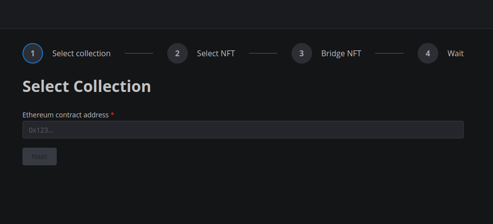

# General Concept

Transfer flow of Ethereum-based NFTs to Stargaze bases heavily on how ERC20 tokens are swapped through Gravity. Since Gravity.sol contract is immutable, new GravityERC721.sol contract has been deployed, which partialy relies on the security of Gravity.sol, because NFTs can be withdrawn from it only if called by `Gravity.sol` directly. Additionally, `x/nft` and `x/nft-transfer` modules have been added to Gravity Chain to enable NFT and ICS721 support.

ERC721 tokens can be deposited in GravityERC721.sol contract using `sendErc721ToCosmos(tokenContractAddress, cosmosDestinationAddress, tokenId)` call. Successful lockup emits the event that is picked up by validators' orchestrators and `Claim` that NFT has been locked up is reported by the validator. When enough validators report the lockup event, `Attestation` is being processed, which mints the NFT on Gravity Chain. If the destination address is not gravity-based, NFT is being added to interchain transfer queue to be sent to destination chain through IBC. Transaction has to be sent to the Gravity Bridge to flush the interchain queue and proceed with IBC transfer. If the destination is on Gravity, then NFT is simply transfered to the indicated receiver. If something goes wrong and freshly minted NFT cannot be delivered, it is being sent to the community pool.

From the user perspective, to transfer NFT to Cosmos, two eth transactions has to be sent - one to approve `GravityERC721.sol` to use user's NFT and the other to deposit the NFT. Then, after the trust period, deposit event is picked up by validators and transfer process continues without any further actions needed from the user.

While we also analyzed potential of transfering Cosmos-originating NFTs to Ethereum, for the sake of GoN hackathon, we've focused on the implementation of bridging Ethereum NFTs to the Cosmos.

To transfer Cosmos-originating NFTs to Ethereum, they will have to be locked in the module account. Next, `GravityERC721.sol` will work as a factory and deploy ERC721 contracts that will correspond to Cosmos' NFT classes as well as mint actual NFTs. These `GravityERC721.sol` calls will verify the presence of Gravity validator signatures similarly to how corresponding calls for ERC20s currently work.

From the UX perspective, user will have to transfer NFT from a Cosmos chain to Gravity through IBC and then send a deposit message to gather validator signatures required for minting on the Ethereum side. With ERC20, user would pay a transaction relaying fee to relayers in the same ERC20 token that is being transfered, but with NFT it's not possible, therefore, user will have to *relay* Ethereum transactions manually with the help of UI.

Similar processes will take place to transfer the NFT back to its origin, but instead of locking it up on the source chain and minting on the destination chain, it's going to be burned at the remote location and unlocked at origin.

Similar to the ERC20 support, each supported destination needs a correct IBC channel to be set up and relayed.

# Work done so far
- Added NFT metadata support to existing GravityERC721.sol
- Connected `x/nft` and `x/nft-transfer` to Gravity Chain
- Added `SendERC721ToCosmosClaim` to `x/gravity` and implemented attestiation handling
- Added separate orchestartor oracle flow for `GravityERC721.sol` contract
- Added integration test happy path flow for bridging ERC721 to Gravity
- Set up a testnet (Gravitygaze) connecting Sepolia and Stargaze Testnet and Omniflix testnet
- Relaying ERC721 transfers from Gravity Bridge to Stargaze Testnet and Omniflix testnet
- Created a demonstration frontend: https://gravity-nft-ui.vercel.app/
    - Code, including an in-depth README of the frontend process: https://github.com/gjermundgaraba/gravity-nft-ui
- Made a gravityjs typescript project to make it easier to interact with the Gravity Bridge from JS, can be found under `gravityjs` (and its use can be found in the gravity-nft-ui code)

A video demonstration can be found here: https://www.youtube.com/watch?v=fow_uQqEak4

For a full overview of the code changes made to the Gravity Bridge, see the following draft PR (made to track these changes):
https://github.com/EmpowerPlastic/Gravity-Bridge/pull/14/files

# How to use

To get yourself some testnet NFTs, you can use the following contract which has a permissionless `mint` method that can be called directly:
https://sepolia.etherscan.io/token/0x715c4c9d6b376b93a22e96d59004be3e118d7e71

You could interact directly with the contracts on the testnet, but we've also created a simple UI that allows you to transfer NFTs from Ethereum to Cosmos. It's available here: https://gravity-nft-ui.vercel.app/
See also the demo video above for a walkthrough.

The ERC721 Bridge contract can be found here: https://sepolia.etherscan.io/address/0x4f2Ff6F09467B176A9d58ccb8E29E81057Ad5FD4

# Future plans

At this point, implementation supports only transfers of Ethereum-based NFTs to Cosmos and that's what can be tested on the running testnet. `GraivtyERC721.sol` has a `withdrawERC721()` function, so it would be possible to unlock NFTs held in the contract with the appropriate Gravity Bridge upgrade. However, we plan to implement flows that will allow NFT transfers back and forth (see General Concept above). UI with good UX is also needed for transfers from Cosmos to Ethereum, because of the need to relay Ethereum transactions manually. Additionaly, for a better security, we plan to move NFT bridging logic from `x/gravity` to a dedicated module.

# Other considerations

During our work, we also considered two different approaches:
1. Implementing `x/gravity` directly on Stargaze instead of using IBC and Gravity Bridge.
2. Utilizing Gravity's arbitrary logic calls for NFT bridging.

Ad. 1. Using `x/gravity` directly implies that every Stargaze validator would have to maintain a trusted full Ethereum node as well as run the orchestrator, which would require validators to significantly increase the resources they allocate for validation, therefore this solution is in our opinion inferior to utilizing Gravity Bridge and IBC protocol.

Ad. 2. While we could potentially benefit from less code duplication, this solution would require additional work on arbitrary logic call mechanism itself, as in it's current state, it wouldn't be able to handle our use-case. Moreover, arbitrary logica calls, are very generic in their design, so using them instead of developing our own dedicated module, would decrease the overall security of the design.

--------
**Authors**

[@gjermundgaraba](https://github.com/gjermundgaraba)

[@ba1ciu](https://github.com/ba1ciu)
